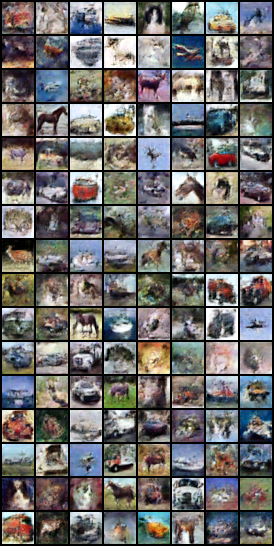
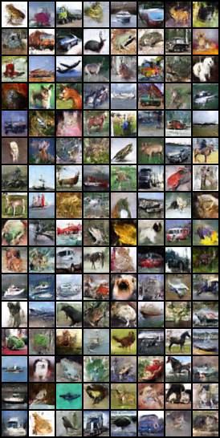
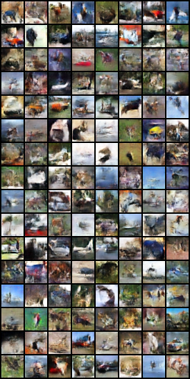

# Denoising Circuits for 1-Step Diffusion

[Python] [PyTorch] [Diffusers] [MIT License]

> We rectify multi-step diffusion into an almost linear "sum of residuals" and distill it into a single-step model, enabling fast one-step generation with compact offline teacher data.

**Key insights:**
- **Rectification**: Transform a highly non-linear reverse diffusion process into a simple sum of residuals
- **Predictability**: Reduced non-linearity makes the latent residual sequence easier to predict directly
- **Error tolerance**: Only the sum matters, so errors in individual residuals average out

## Installation

```bash
pip install torch torchvision diffusers tqdm zstandard
```

## Quick start
```bash
# baseline training
python Main_Diffusion.py

# 1-step distillation
python Main_Distill.py
```

## How to run

### 1) Baseline training (Main_Diffusion.py)

```bash
python Main_Diffusion.py
```

Train with default settings, then optionally continue training by changing `epoch` from 100 → 50 and `step_probs` from `[0.0, 1.0]` → `[0.0, 0.0, 0.0, 1.0]` (set `training_load_weight` appropriately).

Sampling results (T=1000 recurrent steps without updates):

- 100 epochs with `step_probs=[0.0, 1.0] (s=1)` (~5h on A6000):



- +50 epochs with `step_probs=[0.0, 0.0, 0.0, 1.0] (s=3)` (~5h on A6000):



### 2) Distillation (Main_Distill.py)

Offline generation → Distill training → One‑step evaluation

1. Offline teacher data (INT8 + zstd)
   ```bash
   python Main_Distill.py  # mode="generate"
   ```
   - Set `samples_total` to control the number of generated samples

2. Train D
   ```bash
   python Main_Distill.py  # mode="train_d"
   ```
   - Example: `samples_total: 10000, epoch: 500` ~5h (A6000)

3. One‑step evaluation
   ```bash
   python Main_Distill.py  # mode="eval_d"
   ```
   - Set `test_load_weight_d` (e.g., `ckpt_d_100_ema.pt`)
   - Images saved under `sampled_dir` (e.g., `./SampledImgs/distill/`)

Distilled (one‑step) result:



## Recipes
- Reproduce baseline: run Main_Diffusion.py (default), then fine‑tune with updated `step_probs`
- Generate offline data: set mode="generate" in Main_Distill.py and adjust `samples_total`
- Train D: set mode="train_d" (e.g., `samples_total=10000`, `epoch=500`)
- One‑step eval: set mode="eval_d" and provide D checkpoint (`test_load_weight_d`)

## Training details: step_probs and consistency loss
- step_probs: sample depth s during training; s=1 stabilizes early residuals, s=3 improves multi‑step consistency
- Consistency loss: MSE aligning predictions across depths/teacher to reduce discrepancies
- Auxiliary x0 loss: optional MSE on x0 head to stabilize readout and convergence

## Teacher data format (offline)
- `x_T`: float16, shape `[3, 32, 32]`
- `x0_teacher`: float16, shape `[3, 32, 32]`
- `rin0`: per‑channel symmetric INT8 with scales, shape `[C, H, W]`
- `r_chunks`: per‑channel symmetric INT8 with scales, shape `[num_chunks, C, H, W]`

Files are stored as `.npz` containers compressed with zstd (`.zst`). Quantization follows PyTorch AO / FBGEMM‑compatible per‑channel symmetric INT8 with percentile clipping.

## Models

This project uses a pretrained DDPM-CIFAR10 UNet as the teacher. The code automatically selects the model to use:

- **Priority**: Local EMA model at `Diffusion/ddpm_ema_cifar10/unet` (recommended for better performance)
  - Download from: [ddpm_ema_cifar10.zip](https://github.com/VainF/Diff-Pruning/releases/download/v0.0.1/ddpm_ema_cifar10.zip)
  - Extract and place the `ddpm_ema_cifar10` directory under `Diffusion/`
- **Fallback**: Hugging Face Hub model `google/ddpm-cifar10-32` (non-EMA version, used if local EMA model is not found)

The EMA version provides better performance than the non-EMA model, so it is recommended to download and use it.

## References
This project is based on the following repository:

- [zoubohao/DenoisingDiffusionProbabilityModel-ddpm-](https://github.com/zoubohao/DenoisingDiffusionProbabilityModel-ddpm-)

We also use the following pretrained models:
- [ddpm_ema_cifar10](https://github.com/VainF/Diff-Pruning/releases/download/v0.0.1/ddpm_ema_cifar10.zip) (EMA version, recommended)
- [google/ddpm-cifar10-32](https://huggingface.co/google/ddpm-cifar10-32) (non-EMA, fallback)
